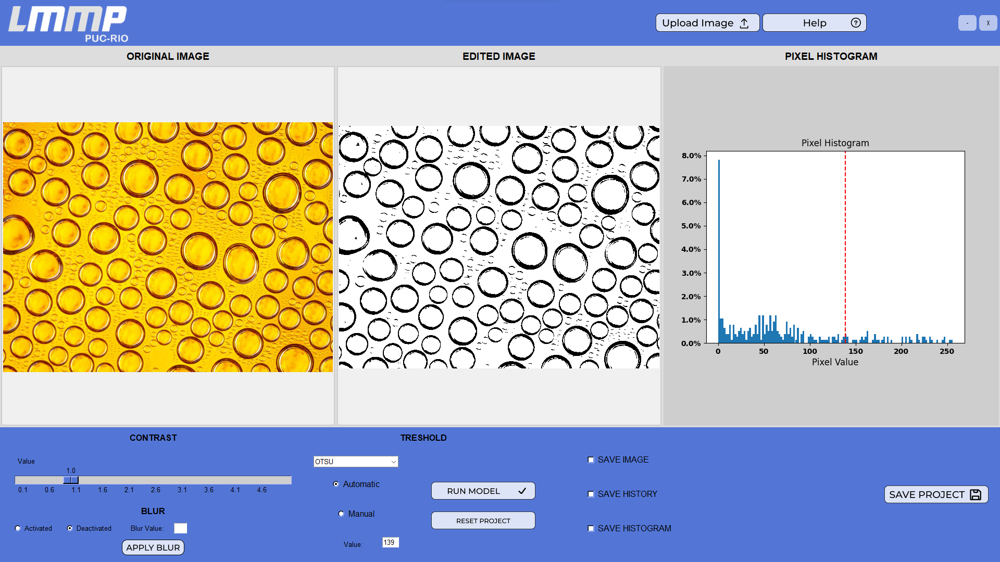

# README #

# Image Processor Tool

This project consists on a tkinter tool to help in the process of image binarization:

After the choose of the correct image you can make the automatic binzaritaion process, like in the following image

## Authors:
Frederico Gomes

Márcio Carvalho

Renan Horta

Rodrigo Lipparelli

Sergio Ribeiro

Vinicius Mattoso 

## Versions:

# September 2023 -> 1.0.0 - Stable version
Date: 2023/09/25

Description: tkinter app stable runing in the LinuxSimulator working without ICV and historymatching for 3 homogeneous reservoirs 

Language Structure: Python
<!-- 
Date: 2023/08/31
Description: .....
Features: ......
Language Structure: Python
 -->

### July 2023 -> 1.0.0-alpha - Prototype tool
Date: 2023/07/31

Description: First prototype of the binarization tool

Language Structure: Python

### Install process on Windows:

1) Create the virtual enviroment;

run:

    python -m virtualenv env

OBS: Make sure that you have the virtualenv model

2) Activate the virtual env;

run:

    env/Scripts/activate

3) Install the requirements models;

run:

    pip install -r requirements.txt

### To build the App on Windows and Linux

run:

    python .\setup.py build

### Setup Guidelines ###

* Summary of set up
* Configuration
* Dependencies
* Database configuration
* How to run tests
* Deployment instructions

### Contribution guidelines ###

* Writing tests
* Code review
* Other guidelines

### Who do I talk to? ###

* Repo owner or admin
* Other community or team contact
