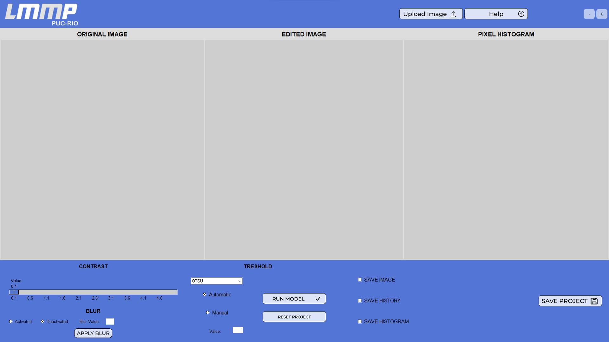
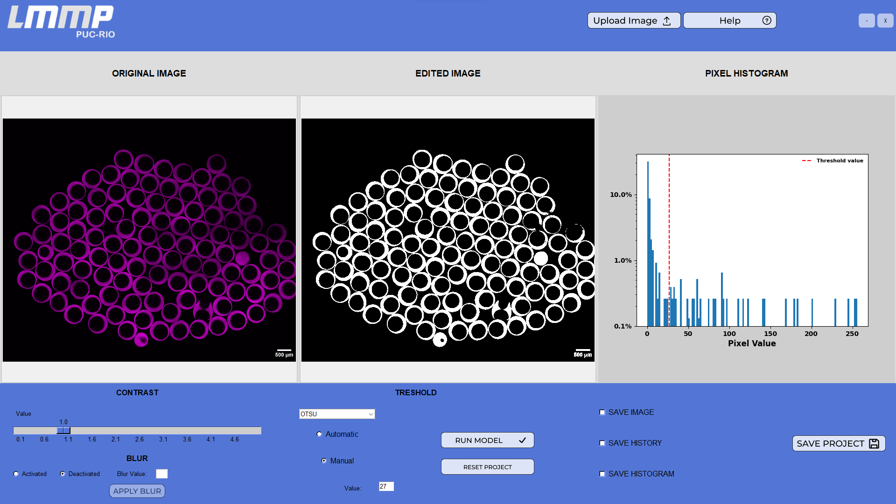
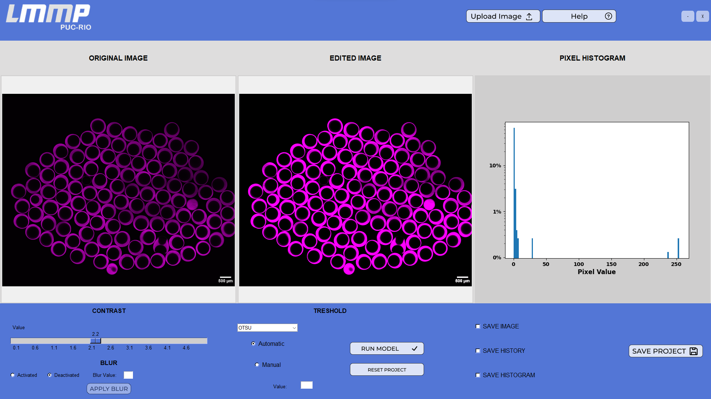
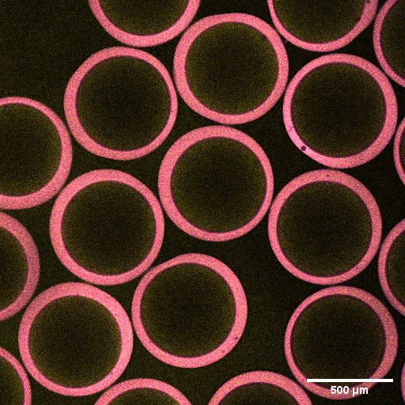

# Image Processor Tool

This project consists of a tkinter tool designed to assist in the image binarization process:

Once the correct image is selected, you can initiate the automatic binarization process, as depicted in the following image:

Additionally, users can enhance the contrast of the original image to improve the binarization process by using the slide bar:

Users have the flexibility to choose between automatic (**OTSU**, **TRIANGLE**) or manual threshold settings for image binarization.

## Authors:
[Frederico Gomes](https://www.linkedin.com/in/frederico-gomes-63b3328/)

[Márcio Carvalho](https://www.linkedin.com/in/marcio-carvalho-ba00b81/)

[Renan Horta](https://www.linkedin.com/in/renanhorta/)

[Rodrigo Lipparelli](https://www.linkedin.com/in/rodrigo-lipparelli-fernandez/)

[Sergio Ribeiro](https://www.linkedin.com/in/ssribeiro82/)

[Vinicius Mattoso ](https://www.linkedin.com/in/vinicius-mattoso/)

## Versions:

# September 2023 -> 1.0.0 - Stable version
Date: 2023/09/25

Description: tkinter app stable runing in the LinuxSimulator working without ICV and historymatching for 3 homogeneous reservoirs 

Language Structure: Python
<!-- 
Date: 2023/08/31
Description: .....
Features: ......
Language Structure: Python
 -->

### July 2023 -> 1.0.0-alpha - Prototype tool
Date: 2023/07/31

Description: First prototype of the binarization tool

Language Structure: Python

### Install process on Windows:

1) Check if the virtualenv packages is already installed in your system

**run**:
    
    pip show virtualenv

If not, please install:

**run**:

    pip install virtualenv

2) Create the virtual enviroment;

**run**:

    python -m virtualenv env

3) Activate the virtual env;

**run**:

    env/Scripts/activate

**OBS**: If the env is not being activated, it may be a problem with Execution Policy Settings. To fix it, you should try executing the following command as admin in Windows PowerShell:

**run**:

    Set-ExecutionPolicy Unrestricted -Scope Process

4) Install the requirements models;

**run**:

    pip install -r requirements.txt

5) Run the Image Processor Tool:

**run**:

    python .\view_image_processor.py

### To build the App on Windows and Linux

run:

    python .\setup.py build

### Application purpose 

* Help with the image binarization process
* Image pretreatments to highlight contours

### Example Images

* **Emulsion example**:

    

    Photo credit: Evgeniy Bobkov/Getty Images

 

* **Capsules example 1**:

    

    Photo credit: [Laboratory of Microhydrodynamics and Flow in Porous Media (LMMP)](http://lmmp.mec.puc-rio.br/)

 

* **Capsules example 2**:  
    

    Photo credit: [Laboratory of Microhydrodynamics and Flow in Porous Media (LMMP)](http://lmmp.mec.puc-rio.br/)

### Who do I talk to?

fell free to contact any **authors** in order to contribute with issues, new challenges, ideas, or comments.
